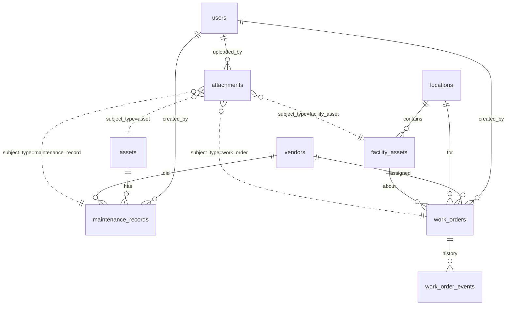

# Data model

The Drizzle schema lives in `app/db/schema.ts` and is the source of
truth. This doc is a human-friendly reference — regenerate mentally when
the schema changes.

## Entity overview

## Tables

### Shared

**`users`** — synced from Cloudflare Access on first login.
- `id`, `email` (unique), `name`, `created_at`

**`vendors`** — mechanics, HVAC techs, plumbers, etc. Shared between Asset
Tracking and Facilities.
- `id`, `name`, `category`, `phone`, `email`, `notes`, `created_at`

**`attachments`** — polymorphic link to any subject. Enforced in code.
- `id`, `r2_key` (unique), `filename`, `mime`, `size`,
  `subject_type`, `subject_id`, `uploaded_by`, `created_at`
- Valid `subject_type` values: `asset`, `maintenance_record`,
  `work_order`, `facility_asset`.

### Asset Tracking

**`assets`** — vans, trailers, equipment.
- `kind`: `van` | `trailer` | `equipment` | `other`
- `status`: `active` | `sold` | `retired`
- Money columns (`*_cents`) are integer cents, not decimals.

**`maintenance_records`** — append-only service log.
- `next_due_date` and `next_due_mileage` on the most recent record drive
  the "due soon" dashboard widget.

### Facilities Maintenance

**`locations`** — the 3 stores (seeded in `0000_initial.sql`).

**`facility_assets`** — HVAC units, water heaters, etc. attached to a
location.
- `kind`: `hvac` | `plumbing` | `electrical` | `refrigeration` | `other`

**`work_orders`** — full ticket workflow.
- `status`: `open` | `scheduled` | `in_progress` | `completed` |
  `cancelled`
- `priority`: `low` | `normal` | `high` | `urgent`
- `facility_asset_id` is nullable so you can open a work order before
  knowing which unit needs service.

**`work_order_events`** — append-only history of status changes and
comments. Never UPDATE a row here.

## Money and dates
- Money: integer `*_cents` only. Format at render time. This makes future
  QuickBooks sync trivial and avoids floating point drift.
- Dates: ISO 8601 strings in `TEXT` columns. D1 is SQLite — there's no
  native `DATE` type, and TEXT sorts chronologically when ISO formatted.

## Changing the schema
1. Edit `app/db/schema.ts`.
2. `npm run db:generate` — writes a new file to `app/db/migrations/`.
3. Review the generated SQL. D1 migrations run forward-only, so write
   them to be safe against existing data.
4. `npm run db:migrate:local` then `npm run db:migrate:remote`.
